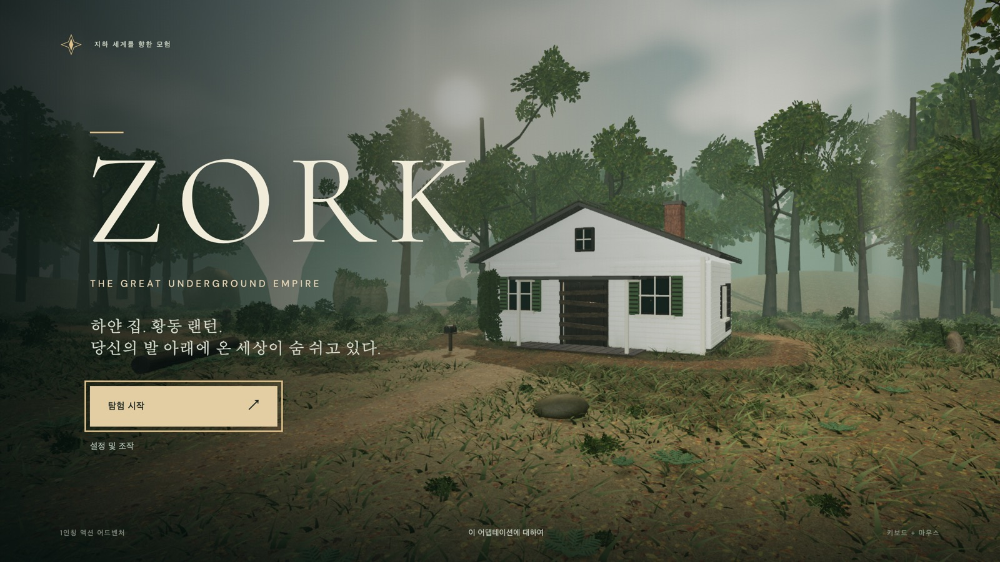

# 조크 · 위대한 지하 제국 (Zork: The Great Underground Empire)

[](/emollick/zork-underground-empire/blob/codex/public-release/public/social/zork-social.jpg)

<p align="center">
  
</p>

**Zork I**의 1인칭 3D 한글화 어댑테이션입니다. 하얀 집과 그 아래 세계를 탐험하고, 퍼즐을 풀며, 트롤과 도둑을 상대하고, 19개의 보물을 되찾아 오세요. 원작 Zork의 묘사가가 한글화된 자막과 함께 여정을 수놓습니다.

**[브라우저에서 플레이하기](https://sigco3111.github.io/zork-underground-empire/)** — WebGL 2를 지원하는 컴퓨터, 휴대폰, 태블릿 어디서나.

> 본 저장소는 **emollick/zork-underground-empire**의 비공식 한글화 포크입니다. 원본은 [Zork I](https://en.wikipedia.org/wiki/Zork_I)의 정통한 단일-저자 어댑테이션을 담아 30개 구역(미로 1개 포함)으로 응축했고, 19개 보물과 스톤 바로우(Stone Barrow) 결을를 따릅니다.

## 목차

- [주요 특징](#주요-특징)
- [실행 방법](#실행-방법)
  - [웹에서 바로 플레이](#웹에서-바로-플레이)
  - [소스로부터 실행](#소스로부터-실행)
  - [Windows 오프라인 패키지](#windows-오프라인-패키지)
- [조작법](#조작법)
  - [키보드와 마우스](#키보드와-마우스)
  - [터치 컨트롤](#터치-컨트롤)
- [게임 진행과 세이브](#게임-진행과-세이브)
  - [저널과 힌트](#저널과-힌)
  - [난이도와 설정](#난이도와-설정)
  - [세이브 슬롯](#세이브-슬롯)
- [게임 세계와 원작](#게임-세계와-원작)
- [원본과의 차이](#원본과의-차이)
- [오픈소스 라이선스 & 크레딧](#오픈소스-라이선스--크레딧)
- [배포와 기술 스택](#배포와-기술-스택)
- [문제 해결](#문제-해결)

## 주요 특징

- **30개 구역의 1인칭 3D 탐험** — 하얀 집, 트롤의 다리, 사이클롭스의 방, 홍수 조절 댐 #3(FCD#3), 아라긴 폭포까지.
- **원작 Zork의 묘사가를 충실히 한글화** — 19개의 보물, 다섯 가지 결이 있는 의식, 그리고 스톤 바로우의 마지막 결까지.
- **실시간 전투와 상황별 상호작용** — 원작의 텍스트 파서를 대체하는 E키 중심의 인터랙션.
- **자동 저널 & 3단계 힌트** — 발견한 것을 자동 기록하고, 살짝 밀어주기부터 명시적인 해답까지 단계별 힌트.
- **저장/내보내기** — 브라우저 저장 + JSON으로 내보내기/가져오기로 다른 브라우저·기기 간 이동.
- **모바일·태블릿 지원** — 터치 컨트롤, 세로/가로 자동 전환, 가상 조이스틱.
- **3단계 난이도** — 탐험가, 모험가, 베테랑.
- **설정 패널** — 그래픽 품질, 시야각, 카메라 감도, 모션 sickness 완화, 사운드 볼륨.
- **오픈소스 MIT 라이선스** — 무료, 학습·개작·재배포 가능.

## 실행 방법

### 웹에서 바로 플레이

별도 설치 없이 [릴리스 페이지](https://sigco3111.github.io/zork-underground-empire/)에서 브라우저만 있으면 됩니다. WebGL 2를 지원하는 모던 브라우저(Chrome, Firefox, Edge, Safari 최신 버전)에서 동작합니다.

> **참고**: 본 사이트는 GitHub Pages로 정적 호스팅되며, 외부 백엔드나 데이터베이스가 필요 없습니다.

### 소스로부터 실행

**Node.js 24**(npm 포함)를 설치한 뒤:

```
git clone https://github.com/sigco3111/zork-underground-empire.git
cd zork-underground-empire
npm ci
npm run dev
```

터미널에 표시되는 주소(보통 `http://127.0.0.1:5193/`)를 브라우저로 여세요. Windows PowerShell 환경에서 스크립트 실행 제한이 있다면 `npm` 대신 `npm.cmd`를 사용하세요. 계정, API 키, 외부 에셋 다운로드 없이도 게임이 동작합니다.

```
npm test        # 캠페인, 퍼즐, 세이브, 경로, 전투, 터치 입력 테스트
npm run check   # TypeScript 타입 검사
npm run build   # 타입 검사 + 정적 사이트 빌드 (dist/)
npm start       # 빌드된 dist/ 정적 사이트를 http://127.0.0.1:5195/에 서빙
```

`dist/`는 완전한 정적 사이트입니다. 텍스처, 폰트, 안내 문구가 빌드에 포함되어 있어 게임을 구동하는 데 백엔드가 필요 없습니다. 개발 서버와 로컬 서빙은 모두 로컬 컴퓨터에 바인딩됩니다.

### Windows 오프라인 패키지

오프라인 플레이가 필요하면 **[최신 릴리스의 Windows 다운로드](https://github.com/sigco3111/zork-underground-empire/releases/latest)**를 받으세요. 자체 런타임이 포함되어 있어 폴더째 압축 해제 후 **Play Zork.cmd**만 더면 됩니다. 본 소스 저장소와 GitHub ZIP은 런타임을 포함하지 않으므로 위의 Node/npm 설정이 필요합니다.

## 조작법

### 키보드와 마우스

| 동작 | 키 / 마우스 |
|------|------|
| 이동 / 둘러보기 | WASD / 마우스, 화살표 키로도 회전 |
| 달리기 / 점프 | Shift / Space |
| 조사· 획득· 사용· 이동 | E |
| 공격 | 마우스 좌클릭 또는 F |
| 방어 / 타이밍 패링 | 마우스 우클릭 누르고 있거나 R |
| 회피 | Q + 이동 방향 (Q만 누르면 뒷걸음) |
| 랜턴 | L |
| 저널 / 지도 / 짐가방 | J / M / Tab |
| 일시정지 | Esc |

마우스 룩(는을 클릭하지 않고 마우스만 움직여 둘러보기)은 버튼을 누르지 않아도 동작합니다. **Esc**를 누르면 포인터가 풀리며, **모험으로 돌아가기**를 눌러 이어할 수 있습니다. 포인터 캡처가 불가능한 환경이라면 마우스를 평소대로 움직이고 가장자리에 가까이 두면 계속 회전합니다.

### 터치 컨트롤

휴대폰이나 태블릿에서는 자동으로 터치 컨트롤이 표시됩니다.

- 왼쪽 스틱을 드래그해 이동, 더 멀리 밀면 달리기.
- 오른쪽 화면을 스와이프해 둘러보기. 이동과 둘러보기를 동시에 할 수 있습니다.
- 프롬프트를 탭해 상호작용.
- **공격**, **회피**, **점프**, **랜턴**, **방어**를 길게 누르세요.
- 아이템을 가진 상태에서는 장비 버튼이 나타납니다.
- 저널, 지도, 짐가방, 일시정지는 화면 메뉴에서 접근.
- 대답 입력 필드를 탭해 키보드를 엽니다.
- 세로/가로 모드 모두 지원.

## 게임 진행과 세이브

### 저널과 힌트

저널은 발견한 것과 이미 읽은 비석을 자동 기록합니다. 세 단계의 힌트 — 살짝 밀어주기에서 명시적 해답까지 — 를 토글할 수 있어요. 미로의 뼈대 옆 메모부터, 스톤 바로우의 마지막 문까지, 어디서 막혔는지 정확히 짚어 줍니다.

### 난이도와 설정

설정에서 **탐험가(Explorer)**, **모험가(Adventurer)**, **베테랑(Veteran)**의 세 가지 난이도를 고를 수 있습니다. 그래픽 품질, 마우스 감도, 사운드 볼륨, 카메라 모션, 모션 sickness 완화 옵션도 자유롭게 조절할 수 있어요.

### 세이브 슬롯

진행 상황은 브라우저에 자동 저장됩니다. **모험 계속하기**로 돌아가거나, 일시정지 메뉴의 **저장 내보내기 / 불러오기**로 다른 브라우저나 기하 사이에서 세이브를 이동할 수 있습니다. **온라인**, **개발**, **로컬** 빌드는 각각 별개의 세이브를 사용합니다. 브라우저 데이터를 지우거나 모험을 새로 시작하기 전에는 반드시 세이브를 내보내 두세요.

## 게임 세계와 원작

본 어댑테이션은 Zork I 원작의 텍스트 모험을 30개 구역으로 응축했고, 19개 보물과 스톤 바로우 결이 있는 결말을 따라갑니다. 원작의 의식(종, 양초, 검은 책)과 미로(다섯 명의 운 없는 모험가 중 하나), 그리고 전투(트롤의 도끼와 도둑의 스틸레토)는 모두 보존되었습니다.

원본 Zork의 묘사가 대부분 그대로 한국어로 옮겨졌으며, 몇몇은 자연스러운 한국어 산문체로 재구성했습니다. 원문의 분위기 — 음산한 지하실, 위험한 냄새, 고풍스러운 신전 — 는 유지하면서 한국어 화자에게 친숙한 어휘로 다듬었어요.

Zork II와 Zork III는 본 어댑테이션의 범위 밖입니다.

## 원본과의 차이

본 저장소는 원본(emollick/zork-underground-empire)을 그대로 포크한 비공식 한글화 버전입니다. 차이점은:

- **모든 인게임 텍스트 한국어 번역** — 방 이름, 아이템 이름, 묘사, 메뉴, 인스크립션, HUD, 시스템 메시지, 힌트까지.
- **`netlify.toml` 제거** — GitHub Pages 배포용으로 변경.
- **`.gitignore` 보정** — 정적 사이트 배포를 위해 `dist/` 포함.
- **표지 이미지는 원본 유지** — 사회적 인식성을 위해 표지 일러스트는 원작 그대로 보존.
- **코드베이스는 원본 유지** — TypeScript 코드, 게임 로직, 구조 변경 없음. 문자열 리터럴만 교체.

## 오픈소스 라이선스 & 크레딧

본 어댑테이션의 코드, 문서, 원본 프로젝트 자산은 [MIT 라이선스](LICENSE)로 배포됩니다. Zork 원작의 텍스트와 산문은 Microsoft의 [MIT 안내문](licenses/ZORK-MIT.txt)을 따릅니다. 외부 텍스처, 폰트, 라이브러리, 런타임은 각자의 라이선스를 유지합니다. 자세한 정보와 범위는 [CREDITS.md](CREDITS.md)를 참고하세요.

표지 이미지는 AI로 생성된 일러스트입니다. 본 어댑테이션은 Microsoft, Activision, Infocom의 공식 엔도르스먼트를 받지 않은 독립적 한글화 프로젝트입니다.

### 주요 외부 의존성

- **[Three.js](https://threejs.org/)** — 3D 렌더링 (MIT)
- **[Vite](https://vitejs.dev/)** — 빌드 도구 (MIT)
- **[TypeScript](https://www.typescriptlang.org/)** — 타입 검사 (Apache-2.0)
- **[@fontsource/dm-sans](https://fontsource.org/fonts/dm-sans)** — UI 폰트 (OFL)
- **[@fontsource/cormorant-garamond](https://fontsource.org/fonts/cormorant-garamond)** — 산문 폰트 (OFL)

## 배포와 기술 스택

- **프레임워크**: Vite 8 + TypeScript 5
- **3D 엔진**: Three.js 0.180 + RoundedBoxGeometry
- **상태 관리**: 일반 TypeScript (외부 상태 라이선스 없음)
- **저장**: `localStorage` + 사용자 다운로드/업로드 (브라우저 간 이동)
- **배포**: GitHub Pages (정적 호스팅)
- **번역 의존성**: 없음 (런타임에 동적 번역 없음, 빌드 시점에 모든 문자열 박혀 있음)

## 문제 해결

- **흰 화면만 보인다** → 브라우저 콘솔을 확인하세요. WebGL 2가 비활성화된 경우 브라우저 설정에서 GPU 가속을 켜세요.
- **글자가 깨진다** → 한글이 깨져 보이면 시스템 폰트가 latin 전용일 수 있습니다. 대부분의 모던 OS는 기본 한글 폰트를 포함하지만, 서버리스 환경에선 폰트 로딩을 기다려 주세요.
- **저장이 안 안 된다** → 시크릿/프라이빗 모드에서는 `localStorage`가 차단됩니다. 일반 모드로 전환하거나 세이브를 수동으로 내보내세요.
- **모바일에서 터치가 안 안된다** → 브라우저의 "데스크톱 사이트 보기"가 켜져 있으면 일부 기하에서 터치가 동작하지 않습니다. 모바일 전용 보기로 전환해 보세요.

---

**즐거운 모험 되세요! 🌲🏠⚔️**

원작: [emollick/zork-underground-empire](https://github.com/emollick/zork-underground-empire)  
MIT © sigco3111 한라화 포크 기여자